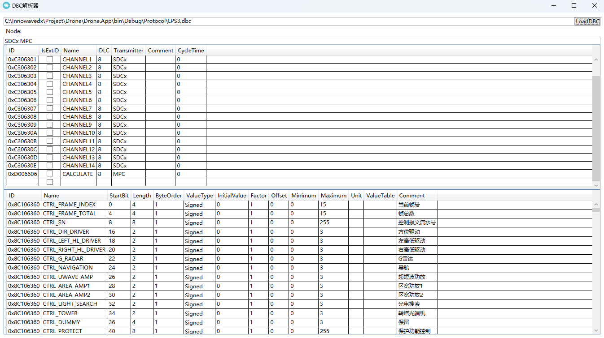

# DBCTool

## CAN协议简介
CAN是控制器局域网络(Controller Area Network)的简称，它是由研发和生产汽车电子产品著称的德国BOSCH公司开发的，并最终成为国际标准（ISO11519），是国际上应用最广泛的现场总线之一。

## 软件功能

**将dbc文件解析成可被直接观测到的数据**

## 界面预览

## 加载数据

**加载dbc文件之后，程序自动根据报文协议将数据展示在软件上**

